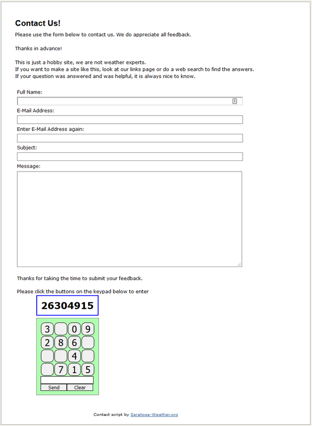
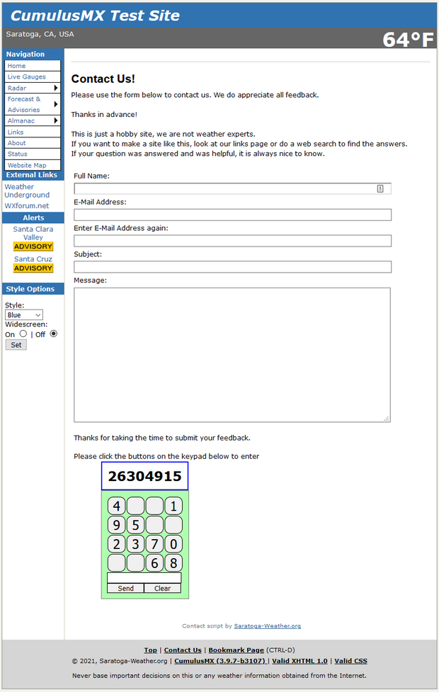

# Contact Page with Login Pad captcha

Having a 'safe' way to contact you on your website is a good idea. In
2008, Mike Challis of 642weather.com released a contact page for both
standalone and Saratoga templates that used a built-in PHP script to
create a captcha that minimized the ability of spambots to post
messages. The bad news is that the spambots have caught on to the
algorithm/structure of that captcha and so now can freely post spam
using the old form/captcha that was released.

The spammer's technology has improved and so Google reCaptcha and
hCaptcha challenges can now be solved by automation and the spam flood
gates seem to have reopened. This script now uses a
resistant-to-automatic-solution called Login Pad. It was written by
[Pierre Fauque](http://www.fauque.fr/dnlphpcl.php) to create a shuffled
keypad that requires click/touch to enter a numeric code. Since
click/touch is required, bots have a hard time with trying to solve this
puzzle. As a bonus, there's no external service used, so no API key is
needed.

This script retools Mike's original form to use the Login Pad class
which is very much more resistant to spambot postings. The scripts come
as a standalone *contactLP.php/contactLP-inc.php* which are English
only. The Saratoga template
*wxcontact.php/contactLP-inc.php/wxcontact-**LL**.html* offers
multilingual use in the template for all supported languages.

## Settings

Configure ***contactLP-inc.php*** with the settings for your website.
```php
############################################################################
# begin settings
############################################################################
# always configure these options before use
# always test your contact form after making changes
#
$kpChallenge = '26304915'; // pick 8 digits, no repeats for the challenge

# optional file to contain the 
$kpChallengeFile = './contactlp-key.txt'; 

# Optional log file.  use '' as the name if a log file is not desired.
$logFile = './contact-loglp.txt'; // optional text log of messages.  use '' to disable.

# email address to receive messages from this form
$mailto = 'somebody@somesite.com';

# Site Name / Title
$sitename = 'My Sitename';

# enable debug display for testing only, should be off (=false;) for production
$showDebug = false; // =false; suppress debug message, =true; enable debug messages
############################################################################
# end settings
############################################################################ ?>
```
  - **$kpChallenge**  
    This variable specifies your numeric challenge code. It should be 8
    digits long, with no repeat digits.
  - **$kpChallengeFile**  
    This variable specifies your OPTIONAL file to read the 8 digit
    $kpChallenge key from. This allows you to change the $kpChallenge
    key without updating the script.
  - **$logFile**  
    This variable controls the optional text logfile of messages sent by
    the script. The default is './cache/contact-log.txt'.  
    **$logFile = '';** will disable creation of a log file.
  - **$mailto**  
    This is the full email address to receive the messages sent via the
    script
  - **$sitename**  
    This is a short name for your website. Email messages will arrive to
    $mailto address with a Subject line of:  
    ""$sitename contact: $subject" (where $subject is from the submitted
    message form).

## Saratoga template multilingual configuration

There are two areas to configure for multilingual configuration. The
*language-**LL**.txt* and *wxcontact-**LL**.html* files are the two
files to configure for each ***LL*** language on your site.

The following entries should be made to *language-**LL**.txt*:

```
#
# wxcontact.php entries
#
langlookup|Full Name:|Full Name:|
langlookup|E-Mail Address:|E-Mail Address:|
langlookup|Enter E-Mail Address again:|Enter E-Mail Address again:|
langlookup|Subject:|Subject:|
langlookup|Message:|Message:|
langlookup|Thanks for taking the time to submit your feedback.|Thanks for taking the time to submit your feedback.|
langlookup|Send|Send|
langlookup|Reset|Reset|
langlookup|Input Forbidden NL|Input Forbidden NL|
langlookup|Input Forbidden|Input Forbidden|
langlookup|A proper email address is required.|A proper email address is required.|
langlookup|The email addresses are not the same.|The email addresses are not the same.|
langlookup|Your name is required.|Your name is required.|
langlookup|A subject is required.|A subject is required.|
langlookup|Please complete the captcha before Send.|Please complete the captcha before Send.|
langlookup|Please make any necessary corrections and try again.|Please make any necessary corrections and try again.|
langlookup|Please enter your name and correct e-mail address here.|Please enter your name and correct e-mail address here.|
langlookup|A few people mistype their e-mail addresses, making it impossible for us to respond.|A few people mistype their e-mail addresses, making it impossible for us to respond.|
langlookup|Please double-check carefully.|Please double-check carefully.|
langlookup|Please click the buttons on the keypad below to enter|Please click the buttons on the keypad below to enter|
langlookup|Too many errors - reload page to retry.|Too many errors - reload page to retry.|
```

Right-click in the above textbox, Select ALL, right-click, Copy then
paste to the end of *language-**LL**.txt* and change the third field
(delimited by **|** ) with the language translation. Make sure the
translation is done using the ISO-8859-n character set appropriate to
your translation, **and not UTF-8**. Save and upload to your website.

Copy *wxcontact-en.html* to *wxcontact-**LL**.html* to make a new
boilerplate file for language ***LL.*** In the new file, the parts to
edit are below the ***$main\_top\_text***, ***$welcome\_intro*** and
***$thank\_you*** variables. You can use a mix of text, HTML and PHP if
you like.  
If you need to use literal dollar signs ( **$** ), escape them by using
( **\\$** ), otherwise you'll have a PHP error.  
Make sure the translation is done using the ISO-8859-n character set
appropriate to your translation, **and not UTF-8**.  
Also be careful to not disturb the end markers for each section.  
Translate the text as desired for each section, save and upload to your
site.  
Note: If *wxcontact-**LL**.html* is not available on your site for
language ***LL***, then the *wxcontact-**en**.html* will be used, and if
it is missing, the text in the *gen\_boilerplate()* function in
*contact-inc.php* will be used.

## Screen captures of standalone and Saratoga template use




